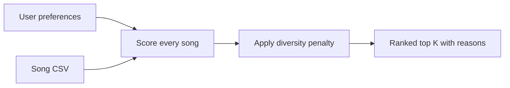

# VibeRank: Music Recommender Simulation

## Project Summary

VibeRank is a CLI-first, content-based music recommender. It compares a listener's stated preferences with the attributes of 20 fictional songs, assigns each song a transparent weighted score, and ranks the strongest matches. The project demonstrates how input data becomes a prediction while also showing how hand-designed weights and a small catalog can introduce bias.

Real services such as Spotify and YouTube can combine two broad approaches. **Collaborative filtering** learns from behavior such as plays, likes, skips, and playlists shared across many users. **Content-based filtering** compares item features such as genre, mood, tempo, and energy with a user's taste. VibeRank uses only content-based filtering: song attributes are the input data, a profile represents user preferences, the scoring strategy transforms each song into a score, and the ranking step selects the highest-scoring songs.

## How the System Works

Each song contains core features (`genre`, `mood`, `energy`, and `tempo_bpm`), audio-style features (`valence`, `danceability`, and `acousticness`), and five added attributes (`popularity`, `release_decade`, `instrumentalness`, `speechiness`, and `duration_min`). A user profile stores a target for each of these attributes.

The default `genre_first` recipe is:

- Exact genre match: **+3.0**
- Exact mood match: **+2.0**
- Energy similarity: up to **+2.0**
- Tempo, valence, danceability, and acousticness similarities: smaller supporting weights
- Five additional feature similarities: small tie-breaking weights

Numerical features reward closeness rather than simply rewarding a high value. For energy, the rule is:

```text
energy points = 2.0 * (1 - abs(song energy - target energy))
```

For example, a song at `0.75` energy compared with a target of `0.80` earns `2.0 * (1 - 0.05) = 1.90` points. `score_song()` applies this recipe to one song and returns both the score and reasons. `recommend_songs()` scores every song, sorts or reranks the catalog, and returns the top `k` songs.



Three switchable strategies are defined in `SCORING_MODES`:

- `genre_first`: prioritizes exact genre matches.
- `mood_first`: gives mood, valence, and acousticness more influence.
- `energy_focus`: halves the default genre weight and doubles the energy weight while emphasizing tempo and danceability.

After initial scoring, optional diversity reranking subtracts `1.0` for a repeated artist and `0.35` for a repeated genre already selected. Every penalty appears in the explanation.

## Getting Started

```bash
python -m venv .venv
```

Activate the environment on Windows:

```powershell
.venv\Scripts\activate
```

Install dependencies and run the program:

```bash
pip install -r requirements.txt
python -m src.main
```

Switch strategies or disable diversity reranking from the CLI:

```bash
python -m src.main --mode mood_first
python -m src.main --mode energy_focus --no-diversity
```

Run the tests:

```bash
pytest
```

Verified test result:

```text
..........                                                               [100%]
10 passed in 0.01s
```

## Sample Recommendation Output

The following results were produced by `python -m src.main`. The complete terminal table also prints every numerical similarity and diversity penalty.

### High-Energy Pop

```text
1. Sunrise City    — 10.06 — genre match (+3.00); mood match (+2.00); energy similarity (+1.94)
2. Golden Weekend  —  9.58 — genre match (+3.00); mood match (+2.00); energy similarity (+1.78); repeated genre penalty (-0.35)
3. Gym Hero        —  7.24 — genre match (+3.00); energy similarity (+1.84); repeated genre penalty (-0.70)
4. Rooftop Lights  —  6.88 — mood match (+2.00); energy similarity (+1.82); tempo similarity (+0.49)
5. Salsa Sunset    —  5.07 — energy similarity (+1.96); tempo similarity (+0.49); valence similarity (+0.48)
```

### Chill Lofi Study

```text
1. Library Rain        — 10.18 — genre match (+3.00); mood match (+2.00); energy similarity (+2.00)
2. Midnight Coding     —  9.59 — genre match (+3.00); mood match (+2.00); energy similarity (+1.86); repeated genre penalty (-0.35)
3. Spacewalk Thoughts  —  6.72 — mood match (+2.00); energy similarity (+1.86); acousticness similarity (+0.46)
4. Focus Flow          —  6.32 — genre match (+3.00); repeated artist penalty (-1.00); repeated genre penalty (-0.70)
5. Coffee Shop Stories —  4.80 — energy similarity (+1.96); acousticness similarity (+0.48); danceability similarity (+0.49)
```

### Deep Intense Rock

```text
1. Storm Runner      — 10.14 — genre match (+3.00); mood match (+2.00); energy similarity (+1.98)
2. Iron Pulse        —  6.83 — mood match (+2.00); energy similarity (+1.88); tempo similarity (+0.41)
3. Gym Hero          —  6.64 — mood match (+2.00); energy similarity (+1.98); tempo similarity (+0.41)
4. Electric Horizon —  4.58 — energy similarity (+1.90); tempo similarity (+0.45); acousticness similarity (+0.46)
5. Salsa Sunset     —  4.44 — energy similarity (+1.82); acousticness similarity (+0.47); duration similarity (+0.24)
```

These profiles produce meaningfully different results. The pop profile selects two happy pop songs first. The lofi profile shifts toward low-energy, acoustic, often instrumental tracks. The rock profile ranks `Storm Runner` first because it is the catalog's only exact rock/intense match; other intense and high-energy songs follow even when their genres differ.

## Experiment: Shifting the Weights

I compared the default strategy with an `energy_focus` strategy that reduced genre from `3.0` to `1.5`, increased energy from `2.0` to `4.0`, and gave tempo and danceability more weight.

```text
Genre-first:  Sunrise City, Golden Weekend, Gym Hero
Energy-focus: Sunrise City, Golden Weekend, Rooftop Lights
```

The change did not merely raise every score. It changed the third recommendation from `Gym Hero` to `Rooftop Lights`. `Gym Hero` has very high energy but does not match the happy mood, while `Rooftop Lights` matches the mood and is closer across several overall-vibe features. This experiment shows that rankings depend on interactions among weights, not one feature alone.

## Limitations and Risks

- The 20-song fictional catalog is too small to represent real musical diversity.
- Exact genre and mood labels cannot represent blended genres or complex emotions.
- Hand-selected weights reflect the designer's assumptions rather than learned user behavior.
- The genre-first mode may form a filter bubble by repeatedly rewarding familiar genres.
- Popularity is treated as similarity to a target, but real popularity signals may reinforce exposure bias.
- The diversity penalty reduces repetition but does not guarantee fairness across artists or cultures.

See the completed [Model Card](model_card.md) for the full evaluation and reflection.

## Reflection

My biggest learning moment was separating scoring from ranking. A scoring rule evaluates one song, but a recommender must apply that same rule consistently across the whole catalog before selecting results. Manually tracing the energy formula made it clear that a target of `0.80` should reward closeness, not automatically favor the highest-energy song.

AI assistance helped expand the dataset, keep the functional and OOP interfaces consistent, and brainstorm the strategy and diversity designs. However, the generated work still needed to be checked against the rubric, executed, and tested. The overly wide first terminal table was one concrete example: the data was correct, but the presentation needed manual refinement. The project showed me how a simple deterministic algorithm can feel personalized while still inheriting bias from its data, features, and weights.
